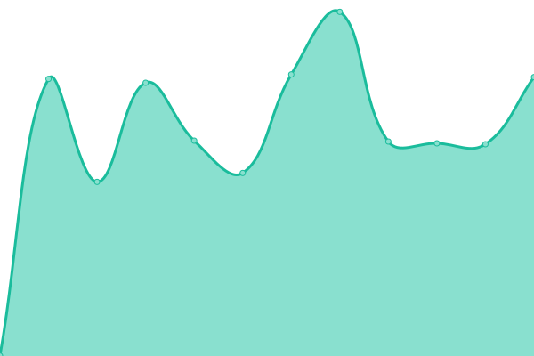
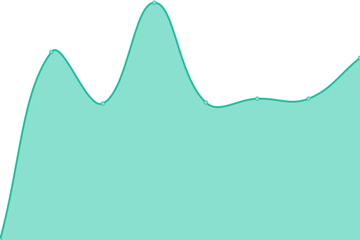
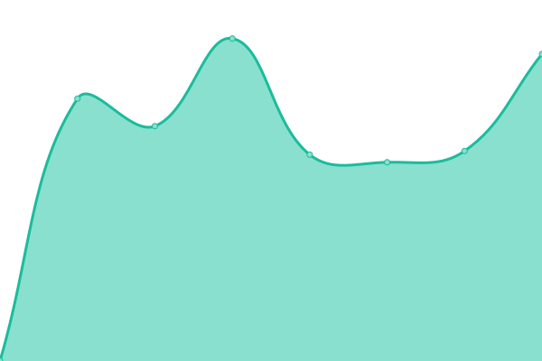
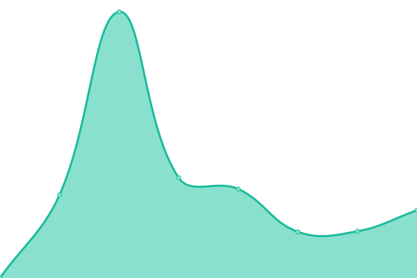

# [📈 Live Status](https://status.cafe-europe.info): <!--live status--> **🟩 All systems operational**

This repository contains the open-source uptime monitor and status page for [Cafe Europe. Nachrichtenagentur AG](https://cafe-europe.info/), powered by [Upptime](https://github.com/upptime/upptime).

With [Upptime](https://upptime.js.org), you can get your own unlimited and free uptime monitor and status page, powered entirely by a GitHub repository. We use [Issues](https://github.com/cafeeurope/status.cafe-europe.info/issues) as incident reports, [Actions](https://github.com/cafeeurope/status.cafe-europe.info/actions) as uptime monitors, and [Pages](https://status.cafe-europe.info) for the status page.

<!--start: status pages-->
<!-- This summary is generated by Upptime (https://github.com/upptime/upptime) -->
<!-- Do not edit this manually, your changes will be overwritten -->
<!-- prettier-ignore -->
| URL | Status | History | Response Time | Uptime |
| --- | ------ | ------- | ------------- | ------ |
|  [Infohalle (prod)](http://portal.infohalle.com/) | 🟩 Up | [infohalle-prod.yml](https://github.com/cafeeurope/status.cafe-europe.info/commits/HEAD/history/infohalle-prod.yml) | 

 820ms
     
 | 

<a href="https://status.cafe-europe.info/history/infohalle-prod">100.00%</a>
    

|  [Infohalle (stage)](https://stage-portal.infohalle.com/) | 🟩 Up | [infohalle-stage.yml](https://github.com/cafeeurope/status.cafe-europe.info/commits/HEAD/history/infohalle-stage.yml) | 

 584ms
     
 | 

<a href="https://status.cafe-europe.info/history/infohalle-stage">99.90%</a>
    

|  [typo3](https://nachrichtenaustausch.ch/typo3/) | 🟩 Up | [typo3.yml](https://github.com/cafeeurope/status.cafe-europe.info/commits/HEAD/history/typo3.yml) | 

 799ms
     
 | 

<a href="https://status.cafe-europe.info/history/typo3">99.82%</a>
    

|  [punkt4](http://punkt4.info/) | 🟩 Up | [punkt4.yml](https://github.com/cafeeurope/status.cafe-europe.info/commits/HEAD/history/punkt4.yml) | 

 1235ms
     
 | 

<a href="https://status.cafe-europe.info/history/punkt4">100.00%</a>
    

|  [swisstrade](http://swisstrade.com/) | 🟩 Up | [swisstrade.yml](https://github.com/cafeeurope/status.cafe-europe.info/commits/HEAD/history/swisstrade.yml) | 

 1172ms
     
 | 

<a href="https://status.cafe-europe.info/history/swisstrade">100.00%</a>
    

|  [cafe europe](http://cafe-europe.info/) | 🟩 Up | [cafe-europe.yml](https://github.com/cafeeurope/status.cafe-europe.info/commits/HEAD/history/cafe-europe.yml) | 

 712ms
     
 | 

<a href="https://status.cafe-europe.info/history/cafe-europe">100.00%</a>
    

|  [ce email](https://host.cafe-europe.info/) | 🟩 Up | [ce-email.yml](https://github.com/cafeeurope/status.cafe-europe.info/commits/HEAD/history/ce-email.yml) | 

 788ms
     
 | 

<a href="https://status.cafe-europe.info/history/ce-email">99.98%</a>
    

<!--end: status pages-->

[**Visit our status website →**](https://status.cafe-europe.info)

## 📄 License

- Powered by: [Upptime](https://github.com/upptime/upptime)
- Code: [MIT](./LICENSE) © [Cafe Europe. Nachrichtenagentur AG](https://cafe-europe.info/)
- Data in the `./history` directory: [Open Database License](https://opendatacommons.org/licenses/odbl/1-0/)
